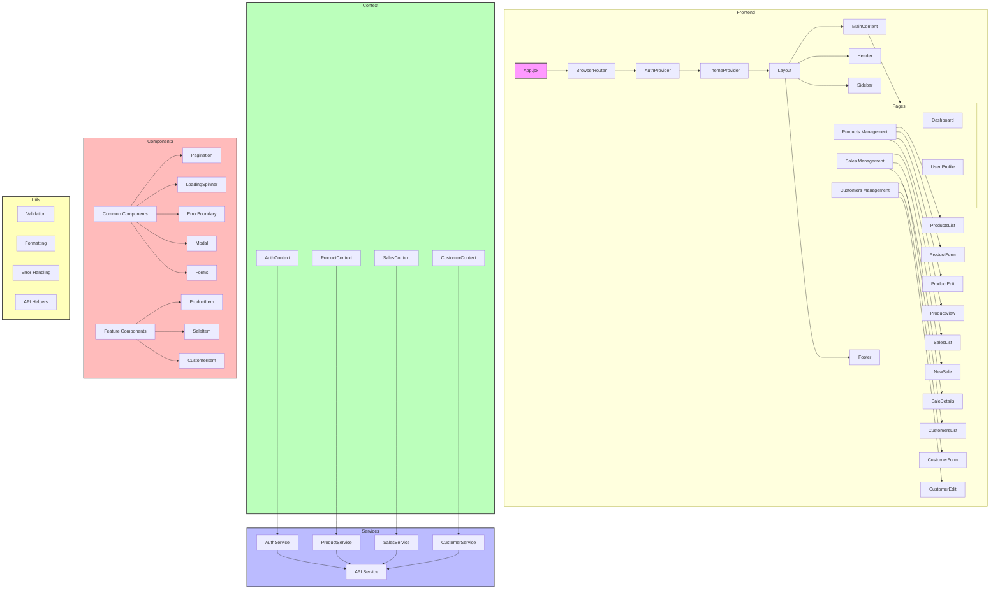

```mermaid
graph TD
    subgraph Frontend
        App[App.jsx]
        Router[BrowserRouter]
        Auth[AuthProvider]
        Theme[ThemeProvider]

        %% Main Layout and Routes
        Layout[Layout]
        Layout --> Header
        Layout --> Sidebar
        Layout --> MainContent
        Layout --> Footer

        %% Context Providers
        App --> Router
        Router --> Auth
        Auth --> Theme
        Theme --> Layout

        %% Pages and Features
        subgraph Pages
            Dashboard[Dashboard]
            Products[Products Management]
            Sales[Sales Management]
            Customers[Customers Management]
            Profile[User Profile]
        end

        MainContent --> Pages

        %% Product Management Flow
        Products --> ProductsList[ProductsList]
        Products --> ProductForm[ProductForm]
        Products --> ProductEdit[ProductEdit]
        Products --> ProductView[ProductView]

        %% Sales Management Flow
        Sales --> SalesList[SalesList]
        Sales --> SaleForm[NewSale]
        Sales --> SaleView[SaleDetails]

        %% Customer Management Flow
        Customers --> CustomersList[CustomersList]
        Customers --> CustomerForm[CustomerForm]
        Customers --> CustomerEdit[CustomerEdit]
    end

    subgraph Services
        AuthService[AuthService]
        ProductService[ProductService]
        SalesService[SalesService]
        CustomerService[CustomerService]
        APIService[API Service]

        %% Service Dependencies
        AuthService --> APIService
        ProductService --> APIService
        SalesService --> APIService
        CustomerService --> APIService
    end

    subgraph Context
        AuthContext[AuthContext]
        ProductContext[ProductContext]
        SalesContext[SalesContext]
        CustomerContext[CustomerContext]

        %% Context Dependencies
        AuthContext --> AuthService
        ProductContext --> ProductService
        SalesContext --> SalesService
        CustomerContext --> CustomerService
    end

    subgraph Components
        %% Common Components
        Common[Common Components]
        Common --> Pagination
        Common --> LoadingSpinner
        Common --> ErrorBoundary
        Common --> Modal
        Common --> Forms

        %% Feature Components
        FeatureComponents[Feature Components]
        FeatureComponents --> ProductItem
        FeatureComponents --> SaleItem
        FeatureComponents --> CustomerItem
    end

    %% Cross-cutting Concerns
    subgraph Utils
        Validation[Validation]
        Formatting[Formatting]
        ErrorHandling[Error Handling]
        APIHelpers[API Helpers]
    end

    style App fill:#f9f,stroke:#333,stroke-width:2px
    style Services fill:#bbf,stroke:#333,stroke-width:2px
    style Context fill:#bfb,stroke:#333,stroke-width:2px
    style Components fill:#fbb,stroke:#333,stroke-width:2px
    style Utils fill:#ffb,stroke:#333,stroke-width:2px
```
